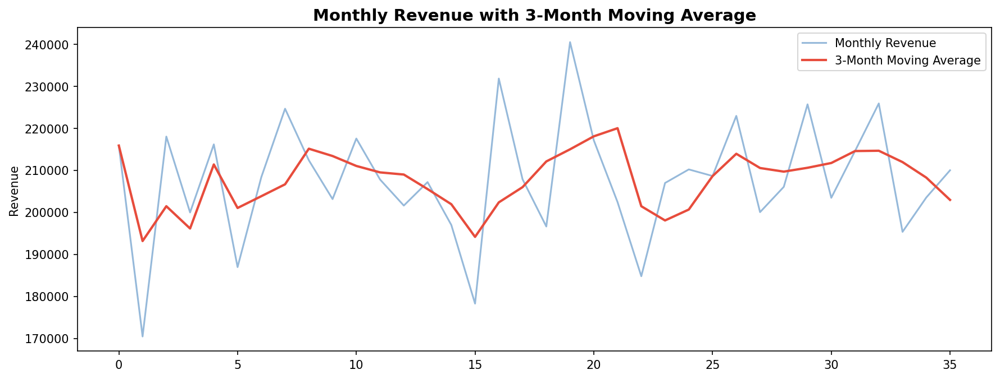

[README_project4.md](https://github.com/user-attachments/files/25710807/README_project4.md)
# 📊 SQL Business Analytics — Window Functions, CTEs & Advanced Queries

## Overview
Comprehensive SQL analytics project demonstrating advanced query techniques on a realistic e-commerce database. Covers window functions, CTEs, RFM segmentation, YoY growth analysis, and business intelligence queries — the most tested SQL skills in data science interviews.

**Built by:** Nithin Kumar Kokkisa — Senior Demand Planner with 12+ years in manufacturing operations & supply chain analytics.

---

## Business Problem
Business leaders need data-driven answers: Which customers are most valuable? What's our revenue trend? Who's at risk of churning? This project builds a complete SQL analytics toolkit to answer these questions using real-world query patterns.

## Database Schema
- **customers** — 1,000 customers across 12 cities, 4 segments
- **products** — 50 products in 5 categories with price and cost
- **orders** — 15,000 orders over 3 years (2022-2024)
- **order_items** — Line-level detail for each order

## SQL Concepts Covered

### Fundamentals
- SELECT, WHERE, ORDER BY, GROUP BY, HAVING
- Aggregations: COUNT, SUM, AVG, MIN, MAX
- INNER JOIN, LEFT JOIN, Multi-table JOINs

### Window Functions
- ROW_NUMBER, RANK, DENSE_RANK
- PARTITION BY (ranking within groups)
- LAG / LEAD (previous/next row comparison)
- Running totals and moving averages
- NTILE (percentile bucketing)

### Advanced Techniques
- CTEs (Common Table Expressions) — single and multiple
- CASE WHEN for conditional logic and pivot-style reports
- Subqueries and correlated subqueries
- Date functions for time-based analysis

### Business Analytics Queries
- Year-over-Year revenue growth
- Month-over-Month change analysis
- Customer retention / repeat purchase rate
- RFM segmentation (Recency, Frequency, Monetary)
- Top N customers per segment
- Revenue trends with 3-month moving average
- Customer spending tiers (Platinum/Gold/Silver/Bronze)

## Key Visualizations



## Sample Query — RFM Segmentation
```sql
WITH rfm AS (
    SELECT customer_id,
           MAX(order_date) as last_order,
           COUNT(DISTINCT order_id) as frequency,
           SUM(quantity * unit_price) as monetary
    FROM orders o
    JOIN order_items oi ON o.order_id = oi.order_id
    GROUP BY customer_id
),
rfm_scores AS (
    SELECT *,
           NTILE(5) OVER (ORDER BY recency ASC) as r_score,
           NTILE(5) OVER (ORDER BY frequency DESC) as f_score,
           NTILE(5) OVER (ORDER BY monetary DESC) as m_score
    FROM rfm
)
SELECT segment, COUNT(*) as customers, AVG(monetary) as avg_ltv
FROM rfm_scores
GROUP BY segment;
```

## Tools & Technologies
- **Python** (sqlite3, Pandas, Matplotlib)
- **SQL** (SQLite — portable, no server needed)
- **Window Functions, CTEs, Subqueries, CASE WHEN**
- **Business Analytics** (RFM, YoY growth, retention analysis)

## How to Run
```bash
# No database installation needed — SQLite runs in Python
pip install pandas matplotlib
python project4_sql_analytics.py
```

---

## About
Part of a **30-project data analytics portfolio**. See [GitHub profile](https://github.com/Kokkisa) for the full portfolio.

**Previous Projects:**
- [Project 1 — Demand Forecasting with Prophet](https://github.com/Kokkisa/demand-forecasting-prophet)
- [Project 2 — ARIMA vs Prophet vs ETS](https://github.com/Kokkisa/forecasting-model-comparison)
- [Project 3 — Customer Churn Prediction with SHAP](https://github.com/Kokkisa/customer-churn-prediction)
